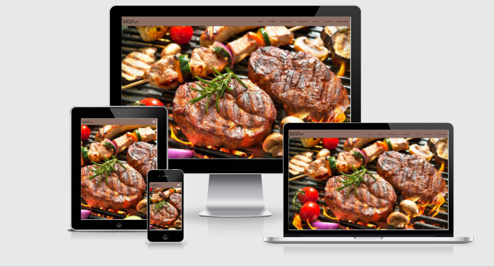
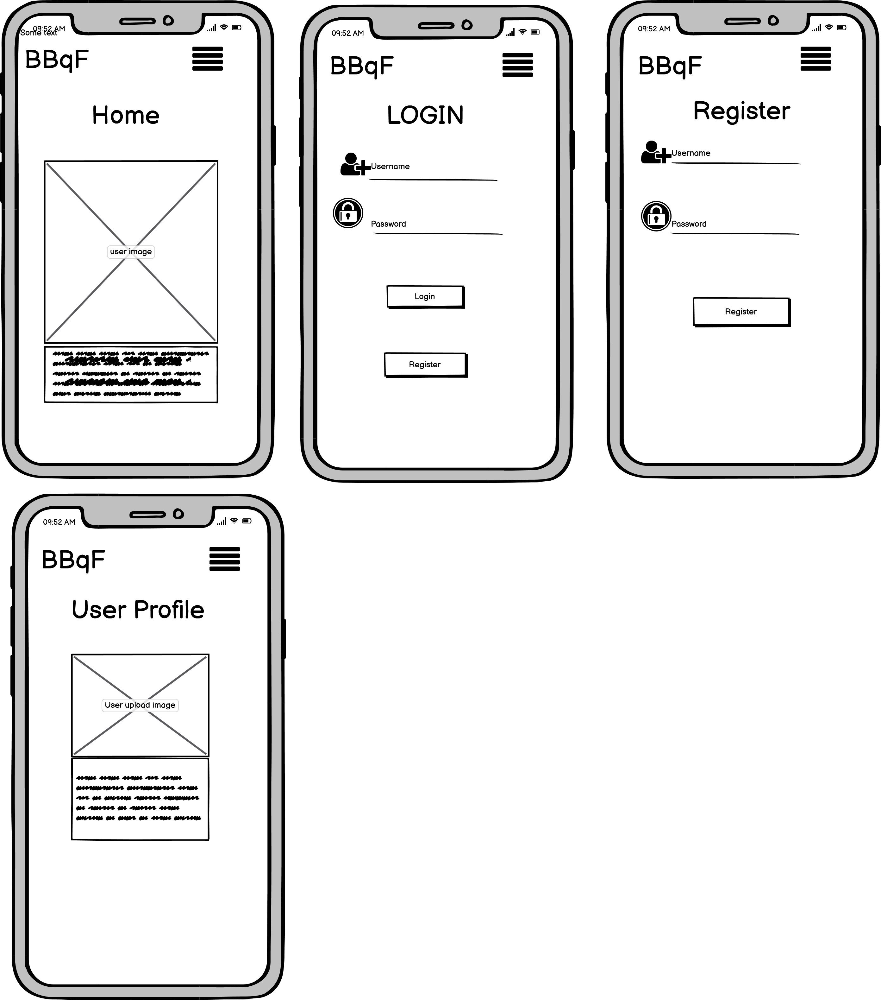
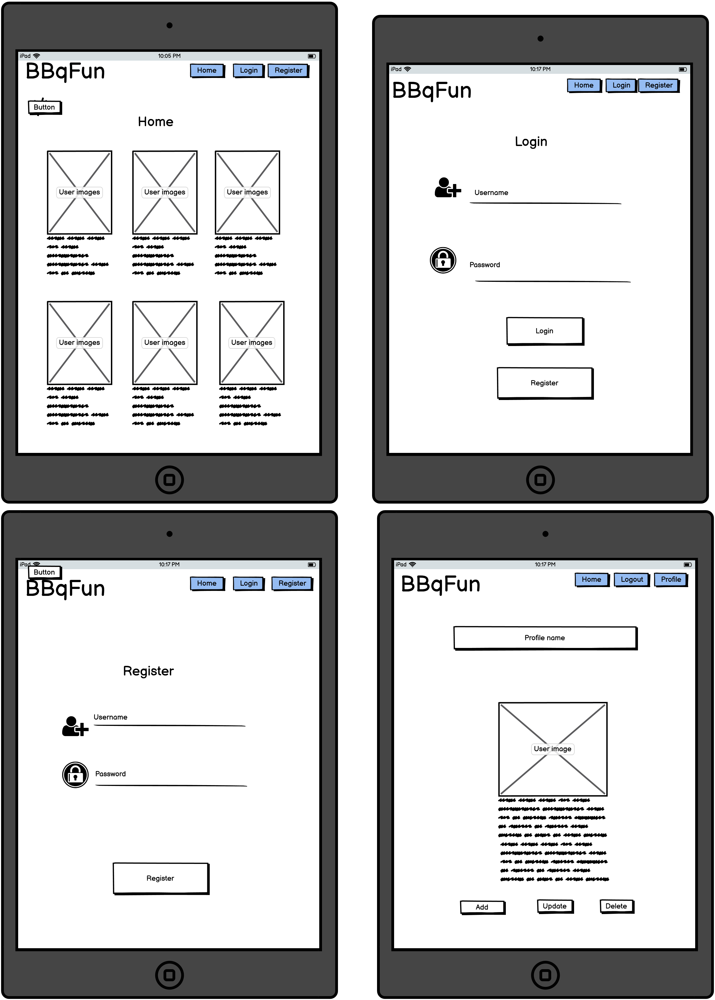
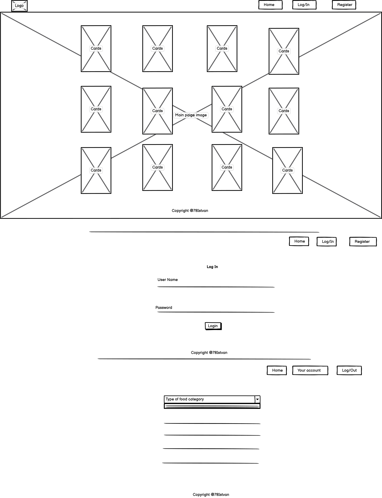

# Build-Five-Project 

## BBQFun

[Live Code](https://flask-food-selection.herokuapp.com/)

# Table of Content

## [User experience](#user-experience)

  - [Project Goal](#project-goal)

  - [External User Goal](#external-user-goal)

  - [Site Owner Goal](#site-owner-goal)

## [Strategy and Scope](#strategy-and-scope)

## [Design](#design)

  - [Color](#color)
  
  - [Styling](#styling)

## [Wireframes](#wireframes)

  - [Phone size wireframe](#phone-size-wireframe)

  - [Tablet size wireframe](#tablet-size-wireframe)

  -  [Desktop size wireframe](#desktop-size-wireframe)

## [Features](#features)

## [Technologies used](#technologies-used)

* [Languages used](#languages-used)

* [Frameworks, Libraries & Programs Used](#frameworks-libraries-&-programs-used)

## [Testing](#testing)

* [Manual Testing](#manual-testing)

* [Functionality Testing](#functionality-testing)

* [Responsive testing](#responsive-testing)

* [Code Validation](#code-validation)

* [Performance Testing](#performance-testing)

## [Deployment](#deployment)

## [Credits](#credits)

* [Media](#media)

* [Content](#content)

* [Acknowledgements](#acknowledgements)

# User experience

## Project Goal

* BBQFun page is made for BBq lovers to find new recipes, ideas, end experiances how to get more professional in this uniq and popular cooking style.
To make a BBq is not only about food, it is about family time, frienship, and fun, and last but not least it is a perfect way to spend our free time outside in a stressless environment.

 * Even if BBq is a popular thing we all were in the situation when we had no ide what to cook, or our usul recipe was getting boring and we wanted to try something new.

 * This website will provide the users to make them own profile, then create, read, upload and if they want delete them own BBq recipes.
  The main pourpose of this site to create and share more and more recipes with everyone who loves BBq and cooking.

## External user goal

 * As a first time user:

   * Understund the main purpose of the site.

   * Find interesting new BBq recipes.

   * Register as a user.

   * Easy to find out how to page working

   * Responsive view on any devices.

   * Quick navigation between pages, without too many clicks. 

 * As a returning user:

   * Easy to login, use my own profile, create new data, upload, or delete if I want.

   * Edit previous recipes.

   * Search based on keyword.

   * Want a website with a good design and excellent and easy navigation.

## Site owner goal

* As site owner:

  * Provide a website to the users where they can share them own house recipes.

  * Organise categories.

  * Add or delete categories.

  * Manage the website such as upload, delete, making changes in design if need.

## Startegy and Scope

The main aim of my site to share recipes between people about them BBq experiences, because for this type of cooking there is no proper hand book, but everyone has them own home recipes, what works very well, but nobody else knows, so I can provide people to edit, upload, and submit them cooking phylosophy on this website.

## Design

* Color

  * 

* Styling 

  * 

### Wireframe

* Phone size wireframe

* Tablet size wireframe 

* Desktop size wireframe 

There are three pages on the picture: Home/Login/Your Account pages

## Features

## Technology used

 * Lenguages used 

 * Frameworks, Libraries & Programs Used

## Testing

 * Manual Testing

 * Functionality Testing

 * Responsive testing

 * Code Validation

 * Performance Testing

## Deployment

  This project was developed using GitPod, pushed to GitHub and deployed using Heroku.

  To deploy to Heroku from the GitHub repository, the following steps were taken:

1. Go to heroku.com and log in
2. Click on "Create new app"
3. Go to Deploy > Deployment method > Github
4. Go to Settings > Config vars and add variables
5. Git add / commit / push Procfile and requirements.txt files
6. Enable automatic deployments from Heroku
7. Click on Deploy branch
### Hot to run this project locally
 To clone this project into Gitpod you will need:

1. A Github account
2. Use the Chrome browser

Then follow these steps:

1. Install the Gitpod Browser Extension for Chrome
2. After installation, restart the browser
3. Log into Gitpod with your gitpod account
4. Navigate to the Project GitHub repository
5. Click the green GitPod button in the top right corner of the repository
6. This will trigger a new gitpod workspace to be created

To work on the project code within a local IDE such as VSCode, Pycharm etc:

1. Follow this link to the [GitHub](https://github.com/78Istvan/Build-five-project) repository
2. Click on the Code button
3. In the drop-down, copy the URL that you see in the HTTPs tab
4. In your local IDE, open the terminal
5. Change the current working directory to the location where you want the cloned directory to be made
6. Type git clone and paste the URL you copied in Step 3
7. Press Enter. Your local clone will be created.

## Credits

## Media

## Content

## Acknowledgements

I am really sorry that I can't finished my project before my deadline.
Unfortunately my family conditions are changed and I just could't spend enough time to put everything together.
After this submission I will continoue working on my project and I will resubmit the 
[BBqFun](https://flask-food-selection.herokuapp.com/) page with all the functionatelies, and design as a proper project should be.
- Istvan Juhasz 

